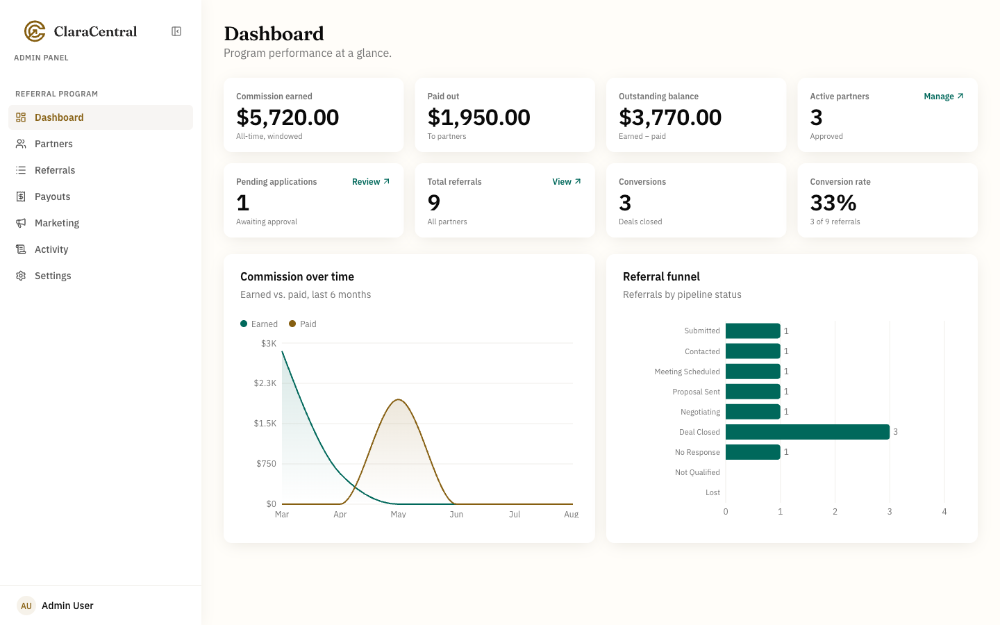
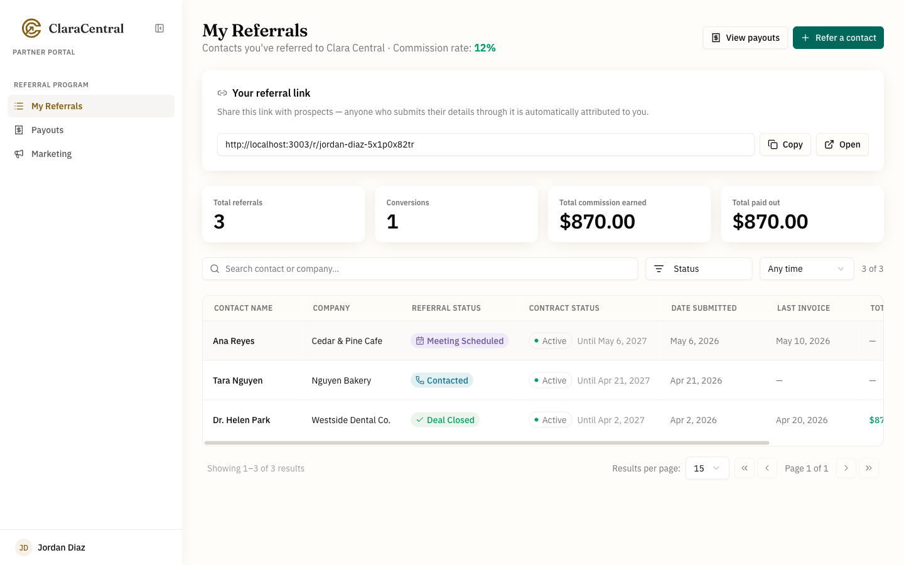
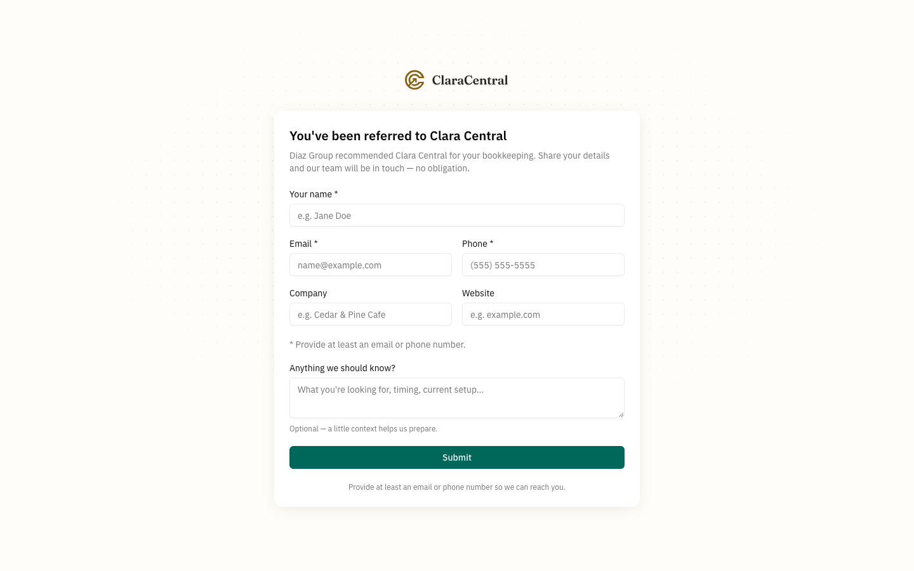

<div align="center">


# Clara Central

### Turn past clients into your best sales channel.

**The source-available referral and commission platform for service businesses.**

Give every partner their own referral link. Follow each prospect from first contact to signed
contract. Accrue commission on every payment that actually lands. Then settle up from a ledger
both sides can audit.

**[▶ Try the live demo](https://app.claracentral.com/demo)** — no signup, no email, your own sandbox.

Free for charities, schools, and other noncommercial organizations, and for personal use.
Businesses need a [commercial license](./LICENSING.md).

[Website](https://claracentral.com) · [Why Clara Central](#why-clara-central) ·
[The product](#what-each-side-sees) · [How the money works](#how-the-money-works) ·
[Features](#everything-in-the-box) · [Quick start](#quick-start) · [Changelog](./CHANGELOG.md)

[](./LICENSE.md)
[](https://github.com/DesignKeyStudio/clara-central/actions/workflows/ci.yml)


</div>



---

## Why Clara Central

Your happiest clients already recommend you. The problem is what happens next: the introduction
arrives in a DM, the deal closes six weeks later, and nobody can say for certain who sent it — or
what they are owed. So the referral gets thanked with a bottle of wine, the partner stops referring,
and the channel quietly dies.

Spreadsheet referral programs fail for a specific reason: **the money is unverifiable.** A partner
cannot see whether their introduction converted. Finance cannot see which payments should accrue
commission. When someone finally asks "why is this number what it is?", there is no answer.

Clara Central makes that number answerable.

|  | |
|---|---|
| **Attribution that doesn't rely on memory** | Every partner gets a personal link. Prospects submit their details on a branded page with no login, and the referral is attributed automatically — with a timestamp. |
| **Commission tied to cash, not promises** | Commission accrues per payment received against the contract, not on the signature. A deal paid in instalments earns incrementally, exactly as the money arrives. |
| **Rates that can never be rewritten** | Each referral freezes the partner's rate the moment it is created. Raising a rate applies to new referrals only — history never re-prices itself. |
| **One ledger, two audiences** | Admins see the whole program. Partners see their own pipeline, earnings, and payout history. Both are reading the same arithmetic. |
| **Your data, your server** | Self-host it. Commission records, partner contacts, and payment history stay in a database you control. |

---

## What each side sees

### Admins run the program

Commission earned, paid, and outstanding at a glance — plus partner counts, referral volume,
conversion rate, commission over time, and where every referral sits in the pipeline. Behind the
dashboard: partner approvals and rates, the full referral pipeline, invoices and payments, payouts,
a marketing asset library, and an activity log recording who changed what.

### Partners see their own numbers



No spreadsheets emailed back and forth, and no questions to answer by hand. Each partner signs in
with a one-time code and sees only their own referrals, their rate, their earnings, and what has
already been paid — alongside the link they share and the marketing material to share with it.

### Prospects just fill in a form



The page behind `/r/<code>` introduces the partner who sent them and asks for a few details. No
account, no login, no friction — and the attribution is recorded before the lead ever reaches your
inbox.

---

## How the money works

The domain model is small, and once you have it the rest of the product is obvious:

```
Partner ──┬── has a commission Rate (%)
          │
          └── shares a referral link  /r/<code>
                        │
                        ▼
                    Referral ──── converts ────► signed contract
                        │
                        ▼
                    Invoices / Payments received
                        │
                        ▼
                Commission accrues at the rate
                captured when the referral was created
                        │
                        ▼
                    Payout ledger (earned vs. paid)
```

Two rules drive everything, and both exist because the system owes money to real people:

- **A referral's rate is frozen at creation.** Changing a partner's rate later applies only to new
  referrals — it never re-prices historical earnings.
- **Commission accrues per payment, not per contract.** A contract paid in instalments accrues
  incrementally, and only within that referral's commission window.

Both are enforced in the service layer rather than the UI, so the arithmetic is auditable and never
recomputed retroactively. If a partner asks how a figure was reached, the answer is a record, not a
recollection.

---

## Everything in the box

<table>
<tr><td width="50%" valign="top">

**Admin panel** — `/admin`, email + password

- Analytics dashboard: commission earned / paid / outstanding, active partners, referral volume,
  conversion rate, commission over time, pipeline funnel
- Partners: invite, review applications, approve or decline, set rates, deactivate, delete
- Referrals: full pipeline, conversion, invoices and payments, private admin-only notes
- Payouts: record and edit payouts against accrued commission
- Marketing library: shareable assets and links with cover images and drag-ordered sections
- Activity log: an audit trail of who changed what
- Settings and account profile

</td><td width="50%" valign="top">

**Partner portal** — `/partner`, one-time-code sign-in

- Their referrals and pipeline status, with earnings per referral
- Their personal referral link, copyable from the dashboard
- Payout history — earned versus paid
- The marketing library
- Self-service profile: name, phone, company, role, location, website, and email/SMS notification
  preferences

</td></tr>
<tr><td valign="top">

**Public pages**

- Partner-first landing page, with admin sign-in tucked into the footer
- `/apply` — self-service application to join the program
- `/invite/<token>` — onboarding from an admin invitation
- `/r/<code>` — a partner's branded referral link, auto-attributed, no login
- `/terms` — the partner agreement (**ships as a template** — have your own counsel review it)
- [`/demo`](https://app.claracentral.com/demo) — a self-resetting demo organization, one per visitor

</td><td valign="top">

**Notifications**

Transactional email via [Resend](https://resend.com) for invitations, approvals and declines,
payouts recorded, referral stage changes, and new invoices.

Entirely optional: with no `RESEND_API_KEY` the app still works and the invite dialog falls back to
"share this link".

</td></tr>
</table>

The schema is multi-tenant — every domain row belongs to an organization — so a single deployment
can host more than one program. Organizations are provisioned in code today, not through the UI.

---

## Try it yourself

**[▶ app.claracentral.com/demo](https://app.claracentral.com/demo)** — no signup and no email required.

Every visitor gets their own throwaway organization, pre-seeded with partners, referrals, contracts
and payments, so you can click through the real product without touching anyone else's data. Pick a
seat:

- **[Admin →](https://app.claracentral.com/demo?role=admin)** — the dashboard, partner approvals, rates,
  the referral pipeline, invoices and payouts.
- **[Partner →](https://app.claracentral.com/demo?role=partner)** — your own referral link, your
  earnings, your payout history.

Sandboxes are isolated per visitor and reaped nightly, so nothing you do there sticks around. The
same route works on your own instance once you have it [running locally](#quick-start).

Prefer to deploy it? One click, then paste in your Supabase keys:

[](https://vercel.com/new/clone?repository-url=https%3A%2F%2Fgithub.com%2FDesignKeyStudio%2Fclara-central&env=DATABASE_URL,DIRECT_URL,NEXT_PUBLIC_SUPABASE_URL,NEXT_PUBLIC_SUPABASE_PUBLISHABLE_DEFAULT_KEY,SUPABASE_SERVICE_ROLE_KEY,NEXT_PUBLIC_PARTNER_OTP_EMAIL,NEXT_PUBLIC_SITE_URL&envDescription=Supabase%20connection%20strings%20and%20auth%20keys&envLink=https%3A%2F%2Fgithub.com%2FDesignKeyStudio%2Fclara-central%2Fblob%2Fmain%2F.env.example)

You will still need to apply the schema once — `pnpm exec prisma migrate deploy` against the new
database — and to read [Deployment](#deployment) before you invite anyone real.

> **Deploying for a business?** Commercial use needs a license before you go live — see
> [LICENSING.md](./LICENSING.md). Charities, schools, and personal projects are covered by the
> free license.

---

## Who it's for

- **Agencies and studios** whose past clients are already the strongest source of new work, and who
  want to reward that properly instead of informally.
- **Consultancies and B2B service firms** with long sales cycles and instalment contracts, where
  commission on signature is the wrong model.
- **Anyone running a partner program on a spreadsheet** who has started to dread the monthly
  reconciliation.

It is deliberately **not** a link-shortener or an ad-network affiliate tool. There is no
click-tracking pixel and no cookie attribution — a referral here is a named human being introduced
by a named partner, converted into a contract you signed.

---

<div align="center">

# Running it yourself

**Everything below is for developers and operators.**<br/>
If you only wanted to know what Clara Central does, you can stop here.

</div>

---

## Quick start

You need **Node 20+**, **pnpm** (`corepack enable pnpm`), and a free [Supabase](https://supabase.com) project.

```bash
git clone https://github.com/DesignKeyStudio/clara-central.git
cd clara-central

./setup.sh                       # installs deps, scaffolds env files, generates the Prisma client
```

Planning to contribute? Fork first and clone your fork — see [CONTRIBUTING.md](./CONTRIBUTING.md).

Then fill in your Supabase values in the two env files `setup.sh` created — runtime config lives in
`.env.local`, and the Prisma CLI reads `prisma/.env` (both gitignored, see [`.env.example`](./.env.example)):

| Variable | Where to find it |
|---|---|
| `DATABASE_URL` (pooler, port 6543, `?pgbouncer=true`) and `DIRECT_URL` (direct, port 5432) | Supabase → Project settings → Database. Both also go in `prisma/.env`. |
| `NEXT_PUBLIC_SUPABASE_URL`, `NEXT_PUBLIC_SUPABASE_PUBLISHABLE_DEFAULT_KEY`, `SUPABASE_SERVICE_ROLE_KEY` | Supabase → Project settings → API |

Finally, apply the schema and start the app:

```bash
pnpm exec prisma migrate dev     # create + apply migrations
pnpm exec prisma db seed         # demo org, admin user, sample partners and referrals
pnpm dev                         # http://localhost:3003
```

Sign in at `/admin/login` with `admin@example.com` / `AdminPass123!` — **local development only.**
These are published here, so treat them as public knowledge. Override with `SEED_ADMIN_EMAIL` /
`SEED_ADMIN_PASSWORD` before seeding any database that is shared or reachable from the internet.

For partner sign-in, use a seeded partner's email; while `NEXT_PUBLIC_PARTNER_OTP_EMAIL` is unset,
any 6-digit code is accepted locally.

### Prototype mode (no Supabase project needed)

Set `NEXT_PUBLIC_PROTOTYPE_MODE="true"` to replace Supabase Auth with a mock: no Supabase project,
no service-role key, and the middleware treats you as an always-signed-in admin. Useful for design
work; not representative of real auth.

> [!NOTE]
> Prototype mode replaces **auth only** — you still need a PostgreSQL database in `DATABASE_URL`,
> because `prisma/schema.prisma` declares `provider = "postgresql"`. A local Postgres or a throwaway
> Supabase project both work; pointing `DATABASE_URL` at a SQLite file does not.

> [!IMPORTANT]
> **Before inviting real partners**, do two things: replace the placeholder legal text in
> [`src/app/terms/page.tsx`](./src/app/terms/page.tsx) with terms reviewed by your own counsel, and
> read [SECURITY.md](./SECURITY.md) — in particular the note on `NEXT_PUBLIC_PARTNER_OTP_EMAIL`,
> whose default is insecure by design for local development.

## Commands

```bash
pnpm dev                   # Dev server with Turbopack (port 3003)
pnpm build                 # prisma generate + next build
pnpm start                 # Serve the production build
pnpm lint                  # ESLint
pnpm typecheck             # tsc --noEmit
pnpm test:unit             # Pure-logic unit tests, no database — what CI gates on
pnpm test                  # Vitest integration tests (needs a seeded database)
pnpm test:e2e              # Playwright end-to-end suite
pnpm storybook             # Storybook on port 6006
pnpm exec prisma studio    # Visual database browser
pnpm exec prisma db seed   # Reseed
```

## Architecture

Three layers, one direction. See [CODEMAP.md](./CODEMAP.md) for the full tree and a
"where to add what" decision table.

```
UI (src/app/**, src/components/**) + React Query hooks
        ↓
Server Actions (src/app/actions/)      ← "use server", auth + org scoping
        ↓
Services (src/lib/services/)           ← pure Prisma business logic, no request context
        ↓
Prisma → PostgreSQL (Supabase)
```

Auth is Supabase Auth; **all application data goes through Prisma**, not the Supabase client.
Admins sign in with email and password, partners with an emailed one-time code. Route protection
lives in [`middleware.ts`](./middleware.ts), and row-level security is enabled on every table as
defence in depth beneath the service-layer checks.

The schema is multi-tenant: every domain row belongs to an `Organization`, and isolation is enforced
in application code by passing an explicit `organizationId` into each service.

## Stack

| Layer | Technology |
|-------|-----------|
| Framework | Next.js 16 (App Router) + React 19 + TypeScript 5 |
| Styling | Tailwind CSS v4 + CSS custom-property design tokens |
| Components | shadcn/ui + ReUI (dual registry, copied in — see `components.json`) |
| Database | PostgreSQL via Prisma 6 |
| Auth | Supabase Auth (auth only; data access via Prisma) |
| Server data | TanStack React Query 5 · Tables: TanStack Table 8 |
| Forms | React Hook Form 7 + Zod |
| Client state | Zustand 5 |
| Email | Resend |
| Testing | Vitest (integration) · Playwright (e2e) · Storybook 10 |

## Deployment

Deploys to Vercel as-is; [`vercel.json`](./vercel.json) pins the region and registers the nightly
demo-cleanup cron. Beyond the variables above, set in your hosting environment:

| Variable | Why |
|---|---|
| `NEXT_PUBLIC_PARTNER_OTP_EMAIL="true"` | **Required in production.** See [SECURITY.md](./SECURITY.md). |
| `NEXT_PUBLIC_SITE_URL` | So invite and referral links in emails point at the right origin |
| `RESEND_API_KEY`, `EMAIL_FROM` | Transactional email from a verified domain |
| `CRON_SECRET` | Shared bearer token authorising `/api/cron/cleanup-demo` |

Run `pnpm exec prisma migrate deploy` against the production database as part of your release step.

## Brand customization

Design tokens live in [`src/app/globals.css`](./src/app/globals.css) — search for
`/* BRAND: customize */`. The shipped palette is a deep accounting green with an identity gold used
for the wordmark and active navigation (never for actions):

```css
--primary: #00685B;   /* primary action — deep accounting green */
--ring: #00685B;      /* focus ring, keep in step with --primary */
```

Fonts (IBM Plex Sans + Fraunces) are registered in `src/app/layout.tsx`. Dark mode inverts
`--primary` to white — check both themes after changing tokens. Record any rules you introduce in
[DESIGN.md](./DESIGN.md) so the rest of the codebase follows them.

The name "Clara Central" and the logos in `public/` are **not** covered by the software license —
see [THIRD-PARTY-NOTICES.md](./THIRD-PARTY-NOTICES.md). Replace them with your own.

## Documentation

| File | Purpose |
|------|---------|
| [PRODUCT.md](./PRODUCT.md) | What the product is, who it's for, scope, glossary |
| [CODEMAP.md](./CODEMAP.md) | Project tree, layer responsibilities, where to add what |
| [COMPONENT.md](./COMPONENT.md) | Catalog of every UI component, with variants |
| [DESIGN.md](./DESIGN.md) | Brand, typography, layout, accessibility rules |
| [STACK.md](./STACK.md) | Why the database, auth, and framework choices are what they are |
| [CLAUDE.md](./CLAUDE.md) | Conventions for AI-assisted work, commands, doc-update discipline |
| [CONTRIBUTING.md](./CONTRIBUTING.md) | How to build, test, and land a change |
| [SECURITY.md](./SECURITY.md) | Reporting vulnerabilities, and what to harden before deploying |
| [CHANGELOG.md](./CHANGELOG.md) | User-facing release notes |
| [LICENSING.md](./LICENSING.md) | Who can use Clara Central free, who needs a commercial license, and how to buy one |
| [THIRD-PARTY-NOTICES.md](./THIRD-PARTY-NOTICES.md) | Licenses of code and assets copied into this repo |

## AI-assisted development

This repo carries its own tooling for agent-driven work, which you're free to ignore — none of it is
required to build or run the app.

- **Living docs.** `CODEMAP.md`, `COMPONENT.md`, and `DESIGN.md` are treated as part of the code:
  changing structure means updating them in the same PR. See the discipline rules in
  [CLAUDE.md](./CLAUDE.md).
- **Skills** in `.claude/skills/` — `update-codemap` and `update-component` keep those maps honest,
  `qa-run` drives a browser-based QA pass, `record-changelog` curates release notes.
  Third-party skills are **not** vendored here; they're pinned in
  [`skills-lock.json`](./skills-lock.json) and installed with `npx skills add`.
- **A QA subagent** (`.claude/agents/playwright-driver.md`) that drives the running app in a real
  browser and asserts against the database, so verification means more than "it compiles."

## Contributing

Bug reports, features, and PRs are welcome — start with [CONTRIBUTING.md](./CONTRIBUTING.md) for the
build, the commit conventions, and the doc-update discipline. By participating you agree to the
[Code of Conduct](./CODE_OF_CONDUCT.md). Security issues go through
[SECURITY.md](./SECURITY.md), never a public issue. Contributions need a signed Contributor License
Agreement before they can be merged — see
[Licensing of contributions](./CONTRIBUTING.md#licensing-of-contributions).

## License

Clara Central is source-available under the
[PolyForm Noncommercial License 1.0.0](./LICENSE.md).

- **Free for noncommercial use.** Charities, educational institutions, public research, public
  safety and health, environmental, and government organizations can use it at no cost, as can
  individuals for personal, non-commercial projects.
- **Commercial use needs a paid license.** That includes a business running its own referral
  program, even internally. Reselling Clara Central or hosting it for other companies needs a
  separate written agreement.

[LICENSING.md](./LICENSING.md) explains who needs which license and how to buy one. Code and
assets copied in from other projects keep their own licenses and are credited in
[THIRD-PARTY-NOTICES.md](./THIRD-PARTY-NOTICES.md). The Clara Central name and logos are not covered
by either license.

---

<div align="center">

Originally built by **[DesignKey Studio](https://designkey.us)**.

</div>
